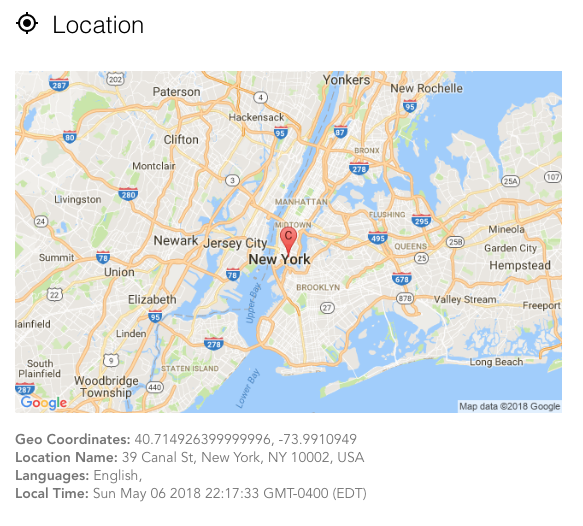
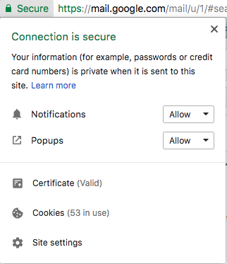
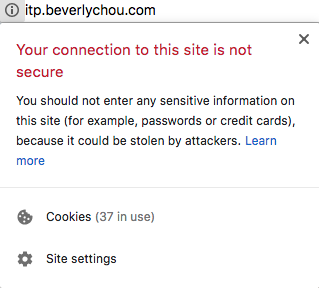

# How Do Companies Track Us Online?

While we browse the Internet, companies are collecting data on us. Similar to what we've seen with the secret chrome URLs, our activity in the browser can be logged. Companies will use this kind of info to draw conclusions about who we are. Sometimes this feels like a bad thing (maybe you don't like targeted ads), but it can also be good, like when a company alerts you that an intruder might've logged into your account.

## What does the browser know?

For starters, go to [Webkay](http://webkay.robinlinus.com/) and take a look at what info the websites immediately know about you. It's a lot! If you are using Chrome, here is what it knows.

* Your location
* Your computer's OS
* Which browser you are using
* Your browser plugins
* The specs of your hardware's CPU and GPU
* Battery level
* Your public and local IP
* Your ISP
* Which social media accounts you are logged into
* Gyroscope (on a phone)
* Scan your local network for devices
* Your mouse movements and clicks

## How do companies identify you?

The combination of the info mentioned above can be used to identify you even if you aren't logging into a website. For instance, if you are consistently logging in with the same IP, location, browser plugins, and screen size, then companies can start to predict that the same person is visiting their website. The data gathered from the browser starts to become a unique fingerprint that identifies you online.

## What are cookies?

Cookies are files that websites can save to your computer. They are used so websites can recognize you and store relevant data about you. For example, cookies are used when e-commerce sites remember what is in your shopping cart or when a weather site remembers your location to show you the right data when you visit.

Third-party cookies are cookies that come from sites other than the one your are on. This means that more data can be assembled on your activity from multiple sites to get a more complete picture of you. These are the kind of cookies that cause you to see targeted ads based on the previous sites you've visited.

There are also supercookies that exist on the ISP level, which means you can't remove them by simply clearing your browsing data. Some ISPs are interested in implementing these kinds of cookies - probably to sell your data.

Take a look at [Evercookie](https://samy.pl/evercookie/), which is an API to create super persistent cookies. There a ton of ways that it tries to save data to your computer and even recreating cookies deleted by the user. This works without the user having to download anything or give permission. It's pretty sneaky.

## What do I do about this?

First of all, these is a lot of info that we voluntarily give to companies and websites. Like when we sign up for Facebook and other social media sites, they often ask for your e-mail, birthday, and other kinds of personal info. Once you're on these sites, they can also see everything you do on their platform. 

You can also see which cookies are being used on each site by clicking on the info button in the address bar of chrome. Here are examples of HTTPS and HTTP sites.

When you use https sites, the info going between your browser and the website is encrypted, which helps to keep your data more secure from outside sources. It does not prevent the HTTPS website you visit from collecting data on you though.

You could also use an extension to prevent unwanted scripts from running on websites. This could help to limit scripts that track your activity. [Scriptsafe](https://chrome.google.com/webstore/detail/scriptsafe/oiigbmnaadbkfbmpbfijlflahbdbdgdf) is a popular one.

You can also prevent cookies from being stored by browsing the web in private mode.

There are many more options, and if you are concerned about companies tracking, I would recommend looking at more options!

## References
* [Here's All the Data Collected From You as You Browse the Web by David Nield](https://fieldguide.gizmodo.com/heres-all-the-data-collected-from-you-as-you-browse-the-1820779304)
* [The Complete Guide to Cookies and All the Scary Stuff Websites Install on Your Computer by David Nield](https://fieldguide.gizmodo.com/the-complete-guide-to-cookies-and-all-the-scary-stuff-w-1794247382)
* [How to Avoid Getting Tracked as You Browse the Web by David Nield](https://fieldguide.gizmodo.com/how-to-avoid-getting-tracked-as-you-browse-the-web-1821008719)
